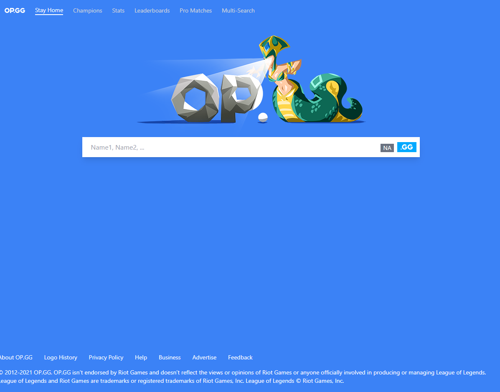

# op.gg clone
This project is built with Next.js and Tailwindcss aka the zoomer stack :)



## Note
I am not affiliated with nor do I respresent op.gg in any way, this is simply just a clone of their site that won't be monetized in any way and is just for learning purposes!

## Usage
1. Git clone it
2. Get a riot API token and put it in a .env file
3. Execute ```npm run dev```
3. Open in browser at 127.0.0.1:3000